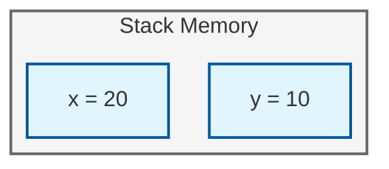
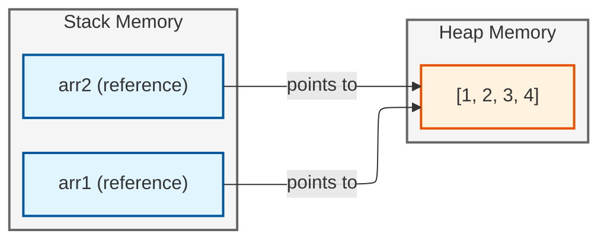

# Variables and Memory

Programs compute by transforming values. Variables give names to intermediate results so we can refer to them, combine them, and build larger computations from smaller ones.

## The Essence of Variables

A variable binds a **name** to a **value**. This is not merely convenient—it's the foundation of abstraction in programming:

```javascript
// Without variables: unreadable, unchangeable
console.log(100 * 0.08 + 100);  // What is this computing?

// With variables: intention is clear
const price = 100;
const taxRate = 0.08;
const total = price * taxRate + price;
console.log(total);  // 108
```

The second version isn't just easier to read. It's easier to *change*. Need a different tax rate? Change one number. Need to compute something else with `price`? It's already named.

**This is the first principle**: name things to make them reusable and changeable.

```javascript
// Creating a variable
let age = 25;

// Using it
console.log(age);  // 25
```

The `let` keyword declares a new variable. The `=` operator binds the name `age` to the value `25`.

## Expressions and Values

Before we go further, understand the difference between **expressions** and **statements**:

- An **expression** produces a value: `2 + 3`, `"hello".toUpperCase()`, `x * y`
- A **statement** performs an action: `let x = 5;`, `console.log(x);`

Every expression can be stored in a variable. This is how we build complex computations from simple parts.

## Types of Values

JavaScript has a small set of fundamental types. Understanding these precisely prevents bugs:

### Numbers

All numbers in JavaScript are 64-bit floating-point. There is no separate integer type:

```javascript
const count = 42;          // Looks like an integer
const price = 19.99;       // Decimal
const temperature = -5;    // Negative

// But watch out - floating point has precision limits
console.log(0.1 + 0.2);    // 0.30000000000000004, not 0.3!
```

Arithmetic operators work as expected:

```javascript
const sum = 10 + 5;        // Addition: 15
const difference = 20 - 8; // Subtraction: 12
const product = 6 * 7;     // Multiplication: 42
const quotient = 15 / 3;   // Division: 5
const remainder = 10 % 3;  // Modulo (remainder): 1
```

<Warning>
Never compare floating-point numbers for exact equality. Instead of `x === 0.3`, check if they're close enough: `Math.abs(x - 0.3) < 0.0001`.
</Warning>

### Strings

Strings are sequences of characters:

```javascript
const name = "Alice";
const greeting = 'Hello';
const message = `Hello, ${name}!`;  // Template literal
```

Template literals (backticks) embed expressions directly: `${expression}` evaluates the expression and converts it to a string.

### Booleans

Booleans are truth values—`true` or `false`. They are the foundation of all conditional logic:

```javascript
const isLoggedIn = true;
const hasPermission = false;
```

### Undefined and Null

Two kinds of "nothing":

```javascript
let notSet;                // undefined - never assigned
const emptyValue = null;   // null - explicitly "no value"
```

Use `null` to explicitly indicate "no value." Undefined usually means "forgot to initialize."

## Type Coercion: The JavaScript Trap

JavaScript automatically converts types. This causes bugs that haunt production code for years:

```javascript
// String + Number = String (concatenation)
console.log("5" + 3);      // "53" (not 8!)

// String - Number = Number (arithmetic)
console.log("5" - 3);      // 2

// Comparison madness
console.log("10" > "9");   // false! (string comparison: "1" < "9")
console.log("10" > 9);     // true (number comparison)
```

<Warning>
**This will bite you.** Always know your types. Use `===` (strict equality) instead of `==` (loose equality with coercion). When in doubt, convert explicitly: `Number("5")`, `String(42)`.
</Warning>

## Primitives vs References: A Mental Model of Memory

This section will shape how you think about data for your entire programming career.

### The Stack and the Heap

When your program runs, it uses two regions of memory:

- **Stack**: Fast, organized. Stores primitive values and references. Fixed size per value.
- **Heap**: Flexible, larger. Stores objects and arrays. Variable size.

### Primitive Values Live on the Stack

Numbers, strings, booleans, `null`, and `undefined` are **primitives**. They're stored directly where the variable is:

```javascript
let x = 10;
let y = x;    // y gets a COPY of the value 10

x = 20;       // Changing x does NOT affect y
console.log(y);  // Still 10
```

Picture it:



Each variable holds its own copy. They are independent.

### Reference Values Point to the Heap

Arrays and objects are **reference types**. The variable holds a *reference* (an address) that points to data stored elsewhere:

```javascript
const arr1 = [1, 2, 3];
const arr2 = arr1;    // arr2 gets a COPY of the REFERENCE

arr1.push(4);
console.log(arr2);    // [1, 2, 3, 4] - same array!
```

Picture it:



Both variables point to the *same* array. When you modify through one, you see the change through the other.

### Why This Matters

This distinction explains:
- Why `const arr = [1,2,3]; arr.push(4);` works (you're not reassigning `arr`, just modifying what it points to)
- Why passing objects to functions can modify the original
- Why you need to explicitly copy arrays/objects if you want independence

<Tip>
**The rule**: Primitives are copied by value. Objects and arrays are copied by reference. Internalize this—it explains bugs in every language with reference types.
</Tip>

## Declaring Variables: The Philosophy of Mutability

JavaScript provides three keywords for declaring variables:

```javascript
let message = "Hello";   // Can be reassigned
const PI = 3.14159;      // Cannot be reassigned
var oldStyle = "avoid";  // Legacy; has confusing scoping rules
```

### The Case for Immutability

**Prefer `const` by default.** This is not a style preference—it's a fundamental principle of reliable software:

```javascript
// Good: const by default
const userName = "Alice";
const taxRate = 0.08;
const items = [1, 2, 3];  // The reference is const, not the contents

// Good: let only when mutation is necessary
let counter = 0;
counter = counter + 1;
```

Why does immutability matter?

1. **Easier to reason about**: If `taxRate` is `const`, you know it's 0.08 everywhere. No need to trace where it might have changed.

2. **Fewer bugs**: Most bugs involve unexpected state changes. Fewer mutable variables = fewer places for bugs to hide.

3. **Better for concurrency**: Immutable data can be safely shared across threads (relevant in workers and future JavaScript features).

4. **Self-documenting**: `const` says "this is a fact." `let` says "this accumulates or tracks something that changes."

```javascript
// let signals intent: "this changes over time"
let totalSales = 0;
for (const sale of sales) {
  totalSales += sale.amount;
}

// const signals intent: "this is computed once and done"
const average = totalSales / sales.length;
```

### When to Use `let`

Use `let` for:
- Loop counters
- Accumulators (totals, sums)
- Values that legitimately change over time (current user, selected item)

If you find yourself writing `let` frequently, ask whether your approach could use more pure functions and transformations instead of mutations.

## Naming Variables

Names are not for the computer. The computer doesn't care if you call a variable `x` or `totalRevenueFromQuarterlySubscriptions`. Names are for humans—including future you.

### The Rules

- Must start with a letter, underscore, or dollar sign
- Can contain letters, numbers, underscores, dollar signs
- Cannot be reserved words (`let`, `if`, `class`, etc.)

### The Art

Good names reveal intent without requiring comments:

```javascript
// Good: reveals what it IS and why it exists
const userName = "Alice";
const itemCount = 10;
const isValidInput = true;
const MAX_LOGIN_ATTEMPTS = 3;  // Constants in UPPER_SNAKE_CASE

// Bad: requires you to read surrounding code to understand
const x = "Alice";
const n = 10;
const flag = true;
```

Conventions:
- **camelCase** for variables and functions: `firstName`, `calculateTotal`
- **UPPER_SNAKE_CASE** for true constants: `MAX_RETRIES`, `API_BASE_URL`
- **PascalCase** for classes and components: `UserAccount`, `ShoppingCart`

### Boolean Naming

Booleans should read like yes/no questions:

```javascript
// Good: reads like a question
const isLoading = true;
const hasPermission = false;
const canEdit = user.role === "admin";

// Bad: unclear what true/false means
const loading = true;
const permission = false;
const edit = true;
```

## Using Variables: Building Computation

Variables let you compose complex calculations from simple parts:

```javascript
const price = 19.99;
const quantity = 3;
const subtotal = price * quantity;
const tax = subtotal * 0.08;
const total = subtotal + tax;

console.log(total);  // 64.77
```

Compare to the "clever" one-liner:
```javascript
console.log(19.99 * 3 * 1.08);  // What is this computing?
```

The first version is longer but:
- Each step is named and understandable
- Intermediate values can be inspected for debugging
- Changes require modifying one place, not re-deriving the formula
- The code *explains itself*

### Reassignment

With `let`, you can reassign:

```javascript
let score = 100;
score = score + 10;  // Now 110
score += 10;         // Shorthand: now 120
```

The `+=`, `-=`, `*=`, `/=` operators combine arithmetic and assignment.

### The Scope of a Variable

A variable exists only within the block where it's declared:

```javascript
const x = 1;

if (true) {
  const y = 2;  // y exists only inside this block
  console.log(x);  // 1 - can access outer variable
  console.log(y);  // 2
}

console.log(x);  // 1
console.log(y);  // ERROR: y is not defined
```

This is called **block scoping**. It prevents variables from leaking into places they don't belong.

## Check Your Understanding

<MultipleChoice
  question="Which keyword creates a variable that cannot be reassigned?"
  options={["let", "const", "var", "both let and const"]}
  correct={1}
/>

<MultipleChoice
  question="What happens when you assign an array to another variable?"
  options={[
    "The array is copied",
    "Both variables point to the same array",
    "An error occurs",
    "The original variable becomes undefined"
  ]}
  correct={1}
/>

<FillBlank
  question="Numbers, strings, and booleans are called ___ types."
  answer="primitive"
  fuzzyThreshold={1}
/>

<MultipleChoice
  question="What does '5' + 3 evaluate to in JavaScript?"
  options={["8", "\"53\"", "\"8\"", "NaN"]}
  correct={1}
/>

<MultipleChoice
  question="Why should you prefer const over let?"
  options={[
    "It's faster",
    "It makes code easier to reason about",
    "It's required for arrays",
    "let is deprecated"
  ]}
  correct={1}
/>

## Try It Yourself

Practice creating and using variables:

<Exercise id="pm-variables" />

## Key Principles

**1. Variables name intermediate results.** Naming makes code readable, debuggable, and changeable.

**2. Know your types.** JavaScript has primitives (number, string, boolean, null, undefined) and reference types (objects, arrays). They behave differently on assignment.

**3. Primitives copy by value; references copy by reference.** Two variables can point to the same object. Understand this or suffer mysterious bugs.

**4. Prefer immutability.** Use `const` by default. Mutable state is where bugs hide.

**5. Type coercion is a trap.** Always use `===`, know what types you're working with, convert explicitly when needed.

**6. Names are documentation.** Future readers (including you) will thank you for `isValidInput` instead of `flag`.

## Summary

You learned:

- Variables bind names to values, enabling abstraction and reuse
- Expressions produce values; statements perform actions
- JavaScript's six primitive types and their behaviors
- The stack/heap mental model for primitives vs references
- Why immutability (`const`) leads to more reliable code
- Type coercion dangers and how to avoid them
- Scope: variables exist only within their declaring block

These concepts transfer to every programming language you'll ever learn. The syntax changes; the principles don't.

Next, we explore how to control which parts of your code run and how to repeat actions using control flow.
