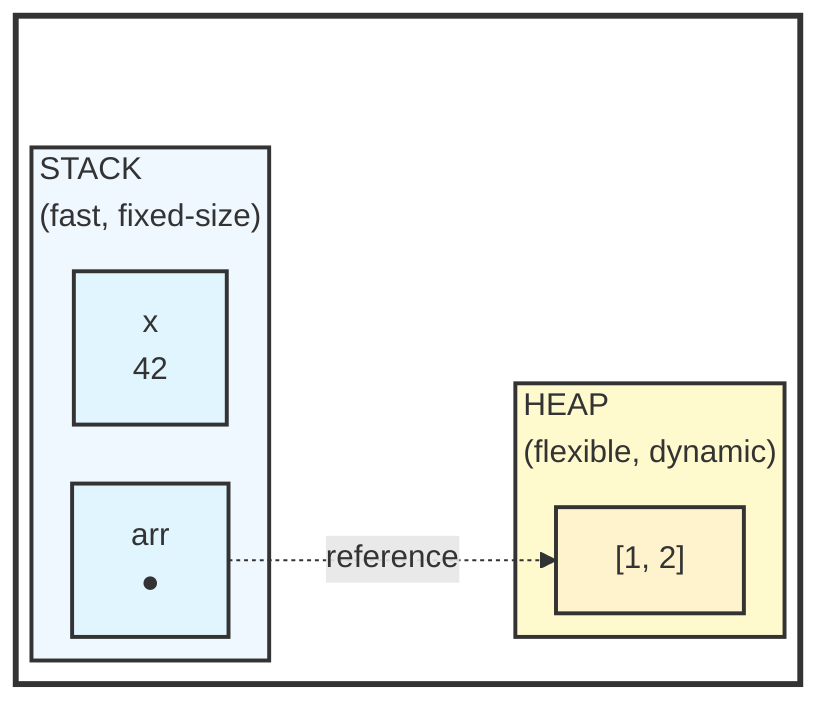
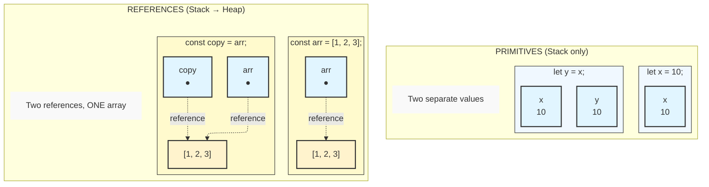

# Memory and References

This lesson teaches one of the most important concepts in all of programming. **Mutable shared state is the single largest source of bugs in software.** Understanding *why* requires understanding how memory works.

Every professional programmer—whether working in JavaScript, Python, Java, Rust, Go, or any other language—will encounter bugs caused by misunderstanding memory and references. The mental model you build here will serve you for decades.

## The Stack and the Heap

Before we can understand JavaScript's behavior, we need to understand where values actually live in memory. Every program has two main regions:

**The Stack**: Fast, small, organized. Values here have fixed sizes known at compile time. When a function is called, its local variables go on the stack. When the function returns, they're automatically cleaned up.

**The Heap**: Slower, larger, flexible. Values here can grow and shrink. Objects, arrays, and strings live on the heap because their size can change.



This is not JavaScript-specific. This is how computers work. The same concepts apply in C, Java, Python, Rust, and virtually every language you will ever use.

## Two Kinds of Values

JavaScript has two categories of values that map to this memory model:

1. **Primitives**: numbers, booleans, `null`, `undefined`, symbols, bigints. These have fixed sizes and are stored directly on the stack.
2. **Reference types**: objects, arrays, functions. These can vary in size and are stored on the heap. The variable on the stack holds a *reference* (an address) pointing to the heap location.

Strings are technically reference types in JavaScript, but they behave like primitives because they are *immutable*—you cannot change a string after it is created. This is a critical observation we will return to.

## Primitives: Copy by Value

When you assign a primitive to another variable, the value is copied directly:

```javascript
let x = 10;
let y = x;    // y gets its own copy of 10

x = 20;       // Changing x has no effect on y

console.log(x);  // 20
console.log(y);  // 10 - unchanged
```

Why does this work safely? Because each variable has its *own* copy of the value. There is no sharing. Changes to one cannot possibly affect the other.

This is the ideal situation: **values that cannot be shared cannot cause sharing bugs.**

## References: Copy by Address

Objects and arrays live on the heap. Variables hold a *reference*—a memory address pointing to where the data actually lives:

```javascript
const arr1 = [1, 2, 3];
const arr2 = arr1;    // arr2 gets a copy of the reference, not the array!

arr1.push(4);

console.log(arr1);    // [1, 2, 3, 4]
console.log(arr2);    // [1, 2, 3, 4] - same array!
```

Both `arr1` and `arr2` hold the *same address*. They point to the *same object in memory*. There is only one array, but two ways to access it.

This is the root of most complexity bugs in programming: **multiple references to shared mutable state.**

## Visualizing Memory



**Commit this diagram to memory.** Draw it yourself on paper. The visual distinction between "two values" and "two references to one value" is fundamental to understanding software bugs.

## Why This Matters: Aliasing

When two variables refer to the same object, they are **aliases**. Changes through one affect the other:

```javascript
function addItem(list, item) {
  list.push(item);
}

const myList = ["apple", "banana"];
addItem(myList, "cherry");

console.log(myList);  // ["apple", "banana", "cherry"]
// The function modified our list!
```

This can be useful or dangerous, depending on whether you intended it.

### A Real Aliasing Bug

Consider this user settings feature:

```javascript
const defaultSettings = {
  theme: "light",
  notifications: true,
  fontSize: 14
};

function createUserSettings(overrides) {
  // BUG: This mutates defaultSettings!
  const settings = defaultSettings;
  if (overrides.theme) {
    settings.theme = overrides.theme;
  }
  return settings;
}

const aliceSettings = createUserSettings({ theme: "dark" });
const bobSettings = createUserSettings({});

console.log(aliceSettings.theme);    // "dark" - correct
console.log(bobSettings.theme);      // "dark" - wrong! Bob wanted default
console.log(defaultSettings.theme);  // "dark" - our defaults are corrupted!
```

The fix is to copy the defaults:

```javascript
function createUserSettings(overrides) {
  // FIXED: Create a new object
  const settings = { ...defaultSettings };
  if (overrides.theme) {
    settings.theme = overrides.theme;
  }
  return settings;
}
```

This bug is subtle because the first call works perfectly. The problem only appears when the function is called again.

## Unintended Mutation

One of the most common bugs in JavaScript comes from accidentally mutating shared data:

```javascript
// Dangerous: function mutates the input
function sortedCopy(arr) {
  return arr.sort();  // sort() modifies the original array!
}

const original = [3, 1, 2];
const sorted = sortedCopy(original);

console.log(sorted);    // [1, 2, 3]
console.log(original);  // [1, 2, 3] - oops! Original is changed!
```

Fix with defensive copying:

```javascript
// Safe: function does not mutate the input
function sortedCopy(arr) {
  return [...arr].sort();  // Create copy first, then sort
}

const original = [3, 1, 2];
const sorted = sortedCopy(original);

console.log(sorted);    // [1, 2, 3]
console.log(original);  // [3, 1, 2] - unchanged
```

<Tip>
When writing functions that take objects or arrays, ask yourself: should this function modify the input, or return a new value? Be explicit about your intent.
</Tip>

## Equality Comparisons

Primitives compare by value. References compare by identity:

```javascript
// Primitives: compare by value
console.log(5 === 5);                // true
console.log("hello" === "hello");    // true

// References: compare by identity (same object?)
console.log([1, 2] === [1, 2]);      // false - different arrays
console.log({} === {});              // false - different objects

const arr = [1, 2];
const sameArr = arr;
console.log(arr === sameArr);        // true - same array
```

To compare object contents, you need to write comparison logic:

```javascript
function arraysEqual(a, b) {
  if (a.length !== b.length) {
    return false;
  }

  for (let i = 0; i < a.length; i++) {
    if (a[i] !== b[i]) {
      return false;
    }
  }

  return true;
}

console.log(arraysEqual([1, 2], [1, 2]));  // true
console.log(arraysEqual([1, 2], [1, 3]));  // false
```

## The `const` Misconception

`const` prevents reassignment, not mutation:

```javascript
const arr = [1, 2, 3];

arr = [4, 5, 6];  // Error! Cannot reassign const

arr.push(4);      // Works! Mutating the array is allowed
console.log(arr); // [1, 2, 3, 4]
```

The `const` keyword locks the *reference* in place, but the object it points to can still change.

## Defensive Copying Patterns

When you receive data that you do not want modified:

```javascript
function processItems(items) {
  // Make a copy before working with it
  const myItems = [...items];

  // Now we can safely modify myItems
  myItems.sort();
  myItems.push("done");

  return myItems;
}
```

When you return data that you do not want others to modify:

```javascript
class ShoppingCart {
  #items = [];  // Private field

  getItems() {
    // Return a copy to protect internal state
    return [...this.#items];
  }

  addItem(item) {
    this.#items.push(item);
  }
}
```

## The Deeper Lesson: Immutability

Defensive copying works, but it treats the symptom, not the disease. The real insight is this:

**If data cannot be mutated, sharing it is perfectly safe.**

Remember how strings work in JavaScript? You can share string references freely because strings cannot be changed after creation. You never write `const safeStr = str.slice()` defensively because there is nothing to defend against.

This is not an accident. This is a design principle: **immutable data eliminates an entire class of bugs.**

Consider two approaches to updating a user:

```javascript
// Approach 1: Mutation (dangerous with sharing)
function updateUserAge(user, newAge) {
  user.age = newAge;  // Mutates the original
  return user;
}

// Approach 2: Immutability (safe with sharing)
function updateUserAge(user, newAge) {
  return { ...user, age: newAge };  // Returns new object
}
```

Approach 2 is safer because the original `user` object is never modified. Any code that was holding a reference to `user` still has the original data. The new object is independent.

This principle scales:

| Situation | Mutable | Immutable |
|-----------|---------|-----------|
| Single-threaded | Bugs from aliasing | Safe |
| Multi-threaded | Race conditions | Safe |
| Debugging | "What changed this?" | Time-travel debugging |
| Testing | Setup/teardown complexity | Isolated tests |

Modern JavaScript libraries like React and Redux are built on immutability. Understanding *why* immutability matters is more important than memorizing their APIs.

<Tip>
When you are unsure whether to mutate or return a new value, default to returning a new value. Mutation should be a conscious choice, not the default.
</Tip>

## Deep vs Shallow Copy

Shallow copy only copies the top level:

```javascript
const original = {
  name: "Alice",
  scores: [90, 85, 95]
};

const shallow = { ...original };
shallow.name = "Bob";           // Does not affect original
shallow.scores.push(100);       // DOES affect original!

console.log(original.scores);   // [90, 85, 95, 100]
```

For true independence, you need deep copy:

```javascript
const original = {
  name: "Alice",
  scores: [90, 85, 95]
};

// Deep copy using structuredClone (modern browsers)
const deep = structuredClone(original);
deep.scores.push(100);

console.log(original.scores);   // [90, 85, 95] - unchanged
```

## Check Your Understanding

<MultipleChoice
  question="What is stored in a variable when it holds an array?"
  options={[
    "The array contents",
    "A reference (address) pointing to the array",
    "A copy of the array",
    "The array's length"
  ]}
  correct={1}
/>

<MultipleChoice
  question="What does const prevent?"
  options={[
    "Mutation of objects",
    "Reassignment of the variable",
    "Both mutation and reassignment",
    "Neither"
  ]}
  correct={1}
/>

<FillBlank
  question="When two variables point to the same object, they are called ___."
  answer="aliases"
  fuzzyThreshold={1}
/>

<MultipleChoice
  question="Why do JavaScript strings never cause aliasing bugs?"
  options={[
    "Strings are stored on the stack",
    "Strings are primitives, not objects",
    "Strings are immutable - they cannot be changed after creation",
    "Strings are automatically copied when assigned"
  ]}
  correct={2}
/>

## Try It Yourself

Practice understanding references and mutation:

<Exercise id="pm-memory" />

## Summary

The facts you learned:

- Stack holds primitives and references; heap holds objects
- Primitives copy by value; references copy by address
- Aliasing occurs when multiple variables reference the same object
- `===` compares references by identity, not by contents
- `const` prevents reassignment but not mutation
- Shallow copy only copies the top level; deep copy copies everything

**The principles that matter more:**

1. **Mutable shared state is the root cause of most complexity bugs.** Every time you create a mutable object and pass it around, you create potential for aliasing bugs.

2. **Immutability eliminates sharing bugs.** If data cannot change, sharing is safe. This is why strings, numbers, and booleans never cause aliasing bugs.

3. **Default to immutability.** When writing functions, prefer returning new objects over mutating inputs. Make mutation a conscious, explicit choice.

4. **These concepts transcend JavaScript.** The same principles apply in Python, Java, Go, Rust, and every other language. Learn them once, apply them everywhere.

You now understand why billion-dollar bugs happen and how to prevent them. Next, we will explore how to handle errors gracefully.
