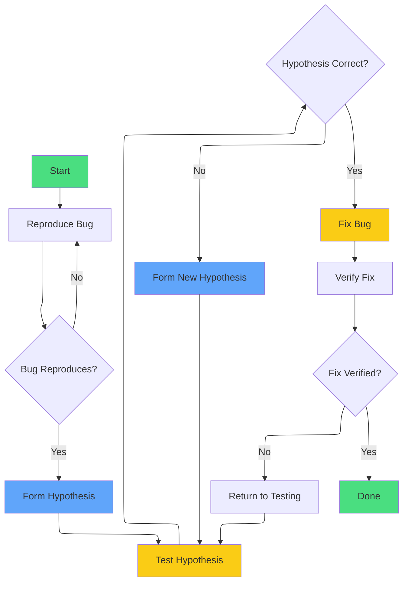
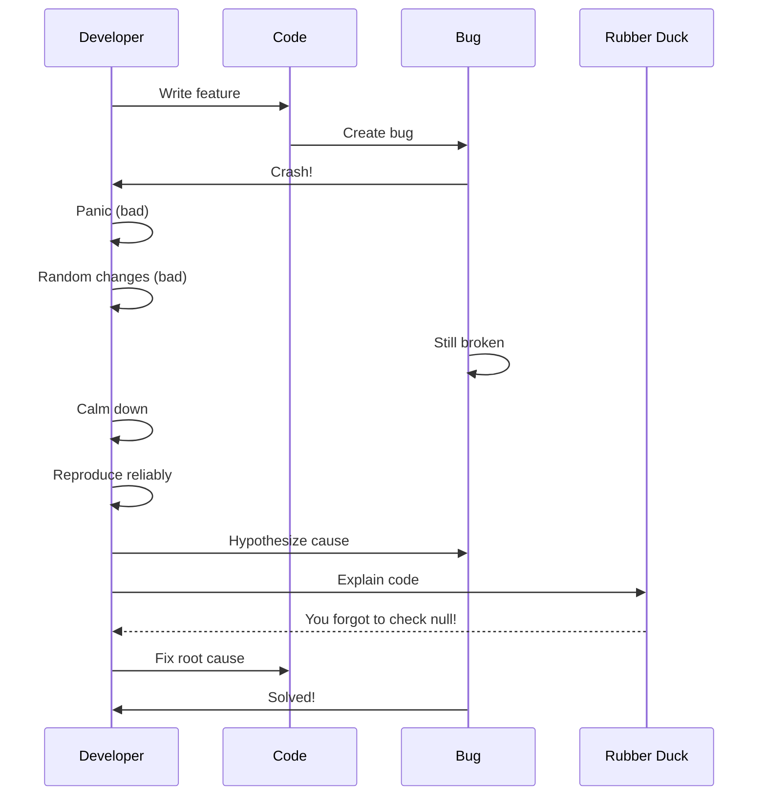

# Debugging

Bugs are inevitable. What separates good programmers from great ones is not writing perfect code, but being systematic about finding and fixing problems.

Here is a truth that took me years to learn: **debugging is not a cleanup task—it is where you become a better programmer.** Every bug you understand deeply teaches you something about how programs work. The best engineers I know actively seek out hard bugs because they know each one makes them stronger.

## The First Rule: Do Not Panic

When your code does not work, resist the urge to randomly change things. Take a breath. Debugging is a skill that improves with practice, and every bug is solvable.

The random-change approach—sometimes called "programming by permutation"—is the mark of an amateur. You change something, run the code, it still fails, so you change something else. This creates two problems: you do not understand why your fix worked (if it does), and you often introduce new bugs while "fixing" the original one.

**Systematic debugging is faster than random debugging**, even though it feels slower at first. Trust the process.

## Three Sources of Bugs

Most bugs come from one of three sources:

1. **Bad values**: A variable contains something unexpected
2. **Faulty logic**: The code does not do what you intended
3. **Wrong assumptions**: Your mental model of how something works is incorrect

Understanding which category your bug falls into determines your debugging strategy:

- **Bad values**: Trace the data backward—where did this value come from?
- **Faulty logic**: Step through the code—what does each line actually do?
- **Wrong assumptions**: Question everything—read the documentation again

Most of your time will be spent on category 3. The code is often correct for what you *told* it to do; you just told it to do the wrong thing.

## The Scientific Method of Debugging

Debugging is like science: form a hypothesis, test it, adjust based on results.

```
1. Reproduce bug reliably
2. Form a hypothesis about the cause
3. Test your hypothesis
4. If wrong, form a new hypothesis
5. If right, fix the bug
6. Verify the fix works
```


1. Reproduce the bug reliably
2. Form a hypothesis about the cause
3. Test your hypothesis
4. If wrong, form a new hypothesis
5. If right, fix the bug
6. Verify the fix works
```

### Step 1: Reproduce Reliably

Before you can fix a bug, you must be able to reproduce it consistently:

```javascript
// What inputs cause the bug?
// What state must the program be in?
// Can you create a minimal example?

// Example: "crashes when sorting"
// Minimal reproduction:
const input = [3, null, 1];
sortNumbers(input);  // Crashes here
```

### Step 2: Form a Hypothesis

Based on the symptoms, guess what might be wrong:

- "Maybe the array contains non-numbers"
- "Maybe the comparison function has a bug"
- "Maybe sort is being called on undefined"

### Step 3: Test Your Hypothesis

Use logging or a debugger to check your hypothesis:

```javascript
function sortNumbers(arr) {
  console.log("Input:", arr);
  console.log("Types:", arr.map(x => typeof x));

  return arr.sort((a, b) => a - b);
}
```

### Step 4: Iterate

If your hypothesis was wrong, the test results give you new information. Form a new hypothesis and repeat.

**Important**: When your hypothesis is disproven, that is progress. You have eliminated one possibility. Sherlock Holmes said it best: "When you have eliminated the impossible, whatever remains, however improbable, must be the truth."

## Fix the Bug, Not the Symptom

Before we discuss techniques, understand this principle: **fix the root cause, not the symptom**.

```javascript
// The symptom: crash when accessing user.name
// Bad fix: hide the symptom
function getUserName(user) {
  try {
    return user.name;
  } catch (e) {
    return "Unknown";  // Silences the error, bug still exists
  }
}

// Good fix: understand WHY user is undefined
// Investigation reveals: fetchUser() returns undefined on network error
// Real fix: handle the network error properly in fetchUser()
```

Silencing errors creates "ghost bugs"—problems that manifest far from their cause, making future debugging much harder. When you encounter an error, ask: "Why is this happening?" not "How do I make it stop?"

## Printf Debugging

The simplest debugging technique: add `console.log` statements to see what your code is doing.

```javascript
function calculateTotal(items) {
  console.log("calculateTotal called with:", items);

  let total = 0;
  for (const item of items) {
    console.log("Processing item:", item);
    console.log("Current total:", total);
    total = total + item.price * item.quantity;
    console.log("New total:", total);
  }

  console.log("Final total:", total);
  return total;
}
```

<Tip>
Use descriptive labels in your log statements. "Value: 42" is not helpful. "item.price after discount: 42" tells you what you are looking at.
</Tip>

### Logging Best Practices

```javascript
// Bad: no context
console.log(x);

// Good: context included
console.log("User age after validation:", x);

// Better: structured for complex data
console.log("Order state:", JSON.stringify(order, null, 2));

// Best: tagged for easy filtering
console.log("[DEBUG] calculateDiscount:", { price, discount, result });
```

Printf debugging is simple and effective for small programs. But as your code grows, you will need more powerful tools.

## Using a Debugger

A debugger lets you pause your program and inspect its state. This is dramatically more powerful than printf debugging because you can examine *any* variable, not just the ones you thought to log.

### Key Debugger Concepts

- **Breakpoint**: A line where execution pauses
- **Step Over**: Execute the current line, move to the next
- **Step Into**: If the line calls a function, go inside that function
- **Step Out**: Finish the current function, return to the caller
- **Watch Expression**: Monitor a variable's value as you step

### Using the Browser Debugger

Every modern browser has a debugger built in (F12 → Sources tab):

```javascript
function processOrder(order) {
  debugger;  // Execution pauses here when DevTools is open

  const subtotal = calculateSubtotal(order.items);
  const tax = subtotal * 0.08;
  const total = subtotal + tax;

  return { subtotal, tax, total };
}
```

When paused, you can:
- Hover over any variable to see its value
- Use the console to evaluate expressions
- Step through code line by line
- See the full call stack

<Tip>
Learning the debugger takes an hour. It will save you hundreds of hours over your career. Invest that hour today.
</Tip>

### When to Use Printf vs. Debugger

| Use Printf | Use Debugger |
|------------|--------------|
| Quick check of a single value | Exploring unfamiliar code |
| Logging in production | Complex state with many variables |
| Async code timing | Step-by-step logic verification |
| Performance profiling | Understanding how code executes |

## Assertions: Catching Bugs Early

An **assertion** is a statement that should always be true. If it is false, your program has a bug:

```javascript
function withdraw(account, amount) {
  // These should ALWAYS be true
  console.assert(amount > 0, "Amount must be positive");
  console.assert(account.balance >= amount, "Insufficient funds");
  console.assert(account.isActive, "Account must be active");

  account.balance -= amount;
  return account.balance;
}
```

Assertions catch bugs at the point of origin, not later when they cause mysterious failures. They are executable documentation—they tell future readers (including you) what the code assumes.

**Key insight**: Code that fails loudly and immediately is easier to debug than code that fails quietly and later.

```javascript
// Good: fails immediately with a clear message
function processItems(items) {
  if (!Array.isArray(items)) {
    throw new Error("processItems requires an array, got: " + typeof items);
  }
  // ... rest of function
}

// Bad: fails later with a confusing message
function processItems(items) {
  // items.map crashes with "items.map is not a function"
  // leaving you to figure out why items isn't an array
  return items.map(process);
}
```

## Binary Search for Bugs

When you have a lot of code and do not know where the bug is, divide the problem in half:

1. Add a log halfway through the code
2. If the bug appears *before* that point, the problem is in the first half
3. If the bug appears *after*, the problem is in the second half
4. Repeat, narrowing down to the exact piece that is broken

```javascript
function complexProcess(data) {
  const step1 = doStep1(data);
  console.log("After step 1:", step1);  // Check here first

  const step2 = doStep2(step1);
  const step3 = doStep3(step2);

  console.log("After step 3:", step3);  // Then check here

  const step4 = doStep4(step3);
  return step5(step4);
}
```

## Reading Stack Traces

When an error is thrown, JavaScript shows a stack trace. Learn to read it:

```
TypeError: Cannot read property 'name' of undefined
    at processUser (app.js:15:23)
    at handleRequest (app.js:42:5)
    at Server.<anonymous> (app.js:67:3)
```

Read from top to bottom:
- Line 1: The error type and message
- Line 2: Where the error occurred (file, line, column)
- Lines 3+: The call stack - how we got here

The error happened at `app.js` line 15, column 23. `handleRequest` called `processUser`, which crashed.

## Rubber Duck Debugging

Explain your code out loud, line by line, to an inanimate object (traditionally a rubber duck). The act of explaining often reveals the bug:

> "Okay, I create an empty array. Then I loop through users... wait, but users might be undefined here..."

This works because it forces you to break the code into pieces and examine each one, rather than glossing over assumptions.

## State Bugs vs. Logic Bugs

Understanding this distinction will make you a faster debugger:

**State bugs**: The code logic is correct, but the data is wrong.
- A variable has an unexpected value
- Data was modified somewhere you did not expect
- A race condition changed state between reads

**Logic bugs**: The data is correct, but the code does the wrong thing.
- Wrong operator `< instead of <=`
- Missing condition
- Algorithm is incorrect

**Diagnosing which type**:

```javascript
function calculateGrade(scores) {
  // Add logging at the entry point
  console.log("Input scores:", scores);

  const average = scores.reduce((a, b) => a + b, 0) / scores.length;
  console.log("Calculated average:", average);

  // If average is NaN, this is a STATE bug (bad input)
  // If average is correct but the wrong grade is returned,
  // this is a LOGIC bug (wrong thresholds below)

  if (average >= 90) return "A";
  if (average >= 80) return "B";
  if (average >= 70) return "C";
  return "F";
}
```

## Common Bug Patterns

### Off-by-One Errors

```javascript
// Bug: uses <= instead of <
for (let i = 0; i <= arr.length; i++) {
  console.log(arr[i]);  // Accesses undefined at the end
}

// Fix: use <
for (let i = 0; i < arr.length; i++) {
  console.log(arr[i]);
}
```

### Undefined/Null Access

```javascript
// Bug: does not check if user exists
function getUserCity(user) {
  return user.address.city;  // Crashes if user or address is undefined
}

// Fix: check first
function getUserCity(user) {
  if (!user || !user.address) {
    return null;
  }
  return user.address.city;
}

// Or use optional chaining
function getUserCity(user) {
  return user?.address?.city ?? null;
}
```

### Wrong Comparison

```javascript
// Bug: uses = instead of ===
if (status = "active") {  // This assigns, always "true"
  doSomething();
}

// Fix: use ===
if (status === "active") {
  doSomething();
}
```

### Async Issues

```javascript
// Bug: returns before async operation completes
function fetchData() {
  let result;
  fetch("/api/data")
    .then(response => response.json())
    .then(data => {
      result = data;
    });
  return result;  // Returns undefined!
}

// Fix: return the promise
async function fetchData() {
  const response = await fetch("/api/data");
  return response.json();
}
```

## Writing Debuggable Code

The best debugging strategy is writing code that is easy to debug in the first place:

### 1. Small Functions with Clear Purposes

```javascript
// Hard to debug: everything happens in one place
function processOrder(order) {
  // 50 lines of validation, calculation, and formatting
}

// Easy to debug: each step is isolated
function processOrder(order) {
  const validated = validateOrder(order);
  const calculated = calculateTotals(validated);
  const formatted = formatForDisplay(calculated);
  return formatted;
}
// If the output is wrong, you can check each step independently
```

### 2. Immutable Data When Possible

```javascript
// Hard to debug: data is modified in place
function applyDiscounts(orders) {
  for (const order of orders) {
    order.total *= 0.9;  // Modified somewhere in a loop
  }
  return orders;
}

// Easy to debug: new data is created
function applyDiscounts(orders) {
  return orders.map(order => ({
    ...order,
    total: order.total * 0.9,
  }));
}
// Original data unchanged, so you can compare before/after
```

### 3. Fail Fast with Clear Messages

```javascript
// Hard to debug: silently does nothing
function sendEmail(to, subject, body) {
  if (!to || !subject) return;  // Silent failure
  // ... send email
}

// Easy to debug: fails loudly
function sendEmail(to, subject, body) {
  if (!to) throw new Error("sendEmail: 'to' is required");
  if (!subject) throw new Error("sendEmail: 'subject' is required");
  // ... send email
}
```

## When You Are Stuck

1. **Take a break**: Fresh eyes often spot problems immediately. This is not weakness—it is neuroscience. Your brain continues processing in the background.
2. **Explain to someone else**: They might see what you are missing
3. **Isolate the piece**: Can you reproduce the bug in a smaller program? This technique—called creating a "minimal reproducible example"—often reveals the bug in the process.
4. **Check your assumptions**: Is the data really what you think it is? Print *everything*.
5. **Read the documentation**: Maybe the API does not work how you think
6. **Search for similar problems**: Others have likely encountered this bug
7. **Question your recent changes**: If it worked before, what did you change? Use `git diff` to see exactly what is different.

## Check Your Understanding

<MultipleChoice
  question="What should you do first when you encounter a bug?"
  options={[
    "Start changing code randomly",
    "Reproduce the bug reliably",
    "Delete the code and rewrite it",
    "Add more features"
  ]}
  correct={1}
/>

<FillBlank
  question="Binary search debugging works by cutting the search space in ___ each time."
  answer="half"
  fuzzyThreshold={0}
/>

<MultipleChoice
  question="What is the most common mistake with array loops?"
  options={[
    "Using for instead of while",
    "Off-by-one errors (wrong boundary)",
    "Using const instead of let",
    "Forgetting semicolons"
  ]}
  correct={1}
/>

<MultipleChoice
  question="What is the difference between fixing a symptom and fixing a bug?"
  options={[
    "There is no difference",
    "Fixing a symptom hides the error, fixing a bug addresses the root cause",
    "Fixing a bug is faster than fixing a symptom",
    "Symptoms only occur in production code"
  ]}
  correct={1}
/>

<FillBlank
  question="An ___ is a statement that should always be true, and crashes the program if violated."
  answer="assertion"
  fuzzyThreshold={0}
/>

## Try It Yourself

Practice debugging techniques:



<Exercise id="pm-debugging" />

## Summary

You learned:

- **Do not panic** - debugging is systematic, not random
- **Three bug sources** - bad values, faulty logic, or wrong assumptions
- **Scientific method** - reproduce, hypothesize, test, iterate
- **Fix the root cause** - never silence errors without understanding them
- **Printf debugging** - strategic `console.log` with good labels
- **Debugger** - breakpoints, stepping, and watch expressions for deep inspection
- **Assertions** - catch bugs at origin with `console.assert` and explicit checks
- **State vs. logic bugs** - determine if the data is wrong or the code is wrong
- **Binary search** - narrow down where the bug is in large codebases
- **Read stack traces** - from top to bottom, find the crash site
- **Rubber duck** - explain code out loud to find problems
- **Common patterns** - off-by-one, null access, wrong comparison, async issues
- **Debuggable code** - small functions, immutable data, fail fast

**The debugging mindset**: Every bug is an opportunity to understand your code better. The best programmers I know are not the ones who write bug-free code—they are the ones who find and fix bugs quickly because they have a systematic approach and deep understanding of how programs execute.

Debugging is a skill that improves with practice. Next, we will explore how to test your code to catch bugs before they happen—because the cheapest bug to fix is the one you never ship.
