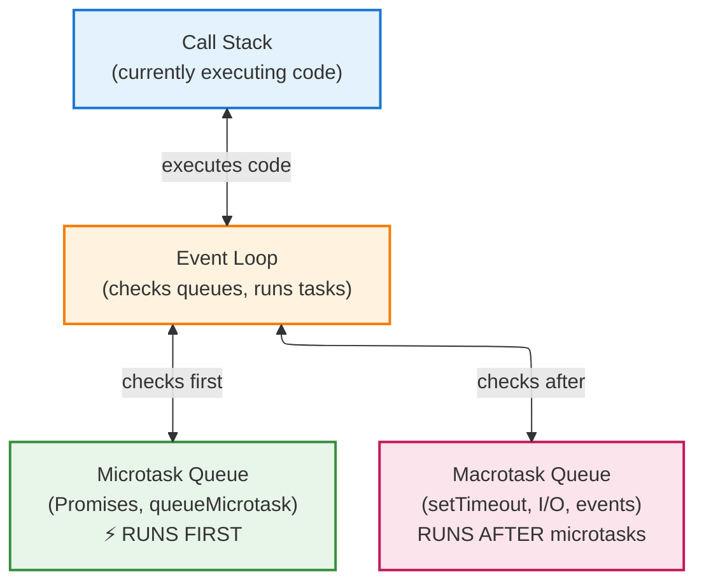

# Callbacks and Events

JavaScript is single-threaded but handles many tasks concurrently. This lesson explains *how* and *why* - and the mental models you need to avoid bugs for the rest of your career.

## The Fundamental Problem: You Cannot Return What Hasn't Happened

Consider reading a file from disk. The disk is **millions of times slower** than the CPU. If your program waited:

```javascript
// HYPOTHETICAL blocking code
const data = readFileSync("huge.txt");  // CPU idles for 50ms (an eternity)
process(data);
```

During those 50ms, your CPU could have executed **millions** of instructions. In a web server, you'd handle zero requests while waiting.

The solution: **don't wait**. Start the operation, continue doing other work, and get notified when it completes.

But this creates a problem: **you cannot return a value from something that hasn't happened yet**.

```javascript
// THIS DOES NOT WORK
function readFile(path) {
  let result;
  startReading(path, (data) => {
    result = data;  // This runs LATER
  });
  return result;  // This runs NOW - result is still undefined!
}
```

This is why callbacks exist. You cannot return the data. Instead, you pass a function that will **receive** the data when it's ready.

## Callbacks: Passing "What To Do Next"

A callback is a function you pass to another function, saying: "when you're done, call this with the result."

```javascript
function greet(name, callback) {
  const message = `Hello, ${name}!`;
  callback(message);  // "Here's the result - do your thing"
}

greet("Alice", (message) => {
  console.log(message);  // "Hello, Alice!"
});
```

This is a **continuation**: you're passing "what to do next" as data. The function receiving the callback decides *when* to continue your program.

<Tip title="The Key Insight">
With callbacks, you invert control. You give your code to someone else to run. This has profound implications for error handling and debugging - you're trusting that other code to call your function correctly.
</Tip>

## Synchronous vs Asynchronous

**Synchronous code** runs line by line. Each line waits for the previous:

```javascript
console.log("1");
console.log("2");  // Waits for line 1
console.log("3");  // Waits for line 2
// Output: 1, 2, 3 (always, guaranteed)
```

**Asynchronous code** schedules work for later and continues:

```javascript
console.log("1");
setTimeout(() => console.log("2"), 1000);  // Schedule for 1 second later
console.log("3");  // Runs immediately - does NOT wait
// Output: 1, 3, 2 (the "2" comes last, after 1 second)
```

This is not just syntax. It's a fundamentally different execution model. The callback `() => console.log("2")` is **saved** and **called later** by the JavaScript runtime.

### Real Async Operations

Here's callback-based file reading in Node.js:

```javascript
import { readFile } from "fs";

readFile("./data.txt", "utf-8", (error, content) => {
  if (error) {
    console.log("Error:", error.message);
    return;
  }
  console.log("Content:", content);
});

console.log("Reading file...");
// Output: "Reading file..." then file content (later)
```

Notice: `"Reading file..."` prints FIRST, even though it's written after `readFile`. The callback is **scheduled**, not executed immediately.

### Error-First Callbacks

Node.js established a convention: the first parameter is always the error.

```javascript
function doAsyncWork(callback) {
  setTimeout(() => {
    const success = Math.random() > 0.5;

    if (success) {
      callback(null, "Result data");  // null = no error
    } else {
      callback(new Error("Something failed"));
    }
  }, 1000);
}

doAsyncWork((error, result) => {
  if (error) {
    console.log("Failed:", error.message);
    return;  // ALWAYS return after handling error
  }
  console.log("Success:", result);
});
```

Why error-first? Because you cannot use `try/catch` with async callbacks:

```javascript
// THIS DOES NOT WORK
try {
  readFile("missing.txt", (err, data) => {
    // The error happens HERE, inside the callback
    // But try/catch already finished long ago!
  });
} catch (e) {
  // This catches NOTHING - the callback runs later
}
```

The `try` block finishes immediately. By the time the callback runs (and potentially errors), the `catch` is long gone. Error-first callbacks solve this by forcing you to handle errors in the same place you handle success.

## The Classic Bug: Closure Capture in Loops

This bug has tripped up every JavaScript developer. Study it until you understand it deeply:

```javascript
// BUG: Prints "3, 3, 3" instead of "0, 1, 2"
for (var i = 0; i < 3; i++) {
  setTimeout(() => {
    console.log(i);  // All callbacks see the SAME i
  }, 100);
}
```

Why? The callbacks don't run until 100ms later. By then, the loop has finished and `i` is 3. All three callbacks share the SAME `i` variable.

**Fix 1**: Use `let` instead of `var` (creates a new `i` each iteration):

```javascript
for (let i = 0; i < 3; i++) {
  setTimeout(() => {
    console.log(i);  // Each callback has its own i
  }, 100);
}
// Output: 0, 1, 2
```

**Fix 2**: Create a closure to capture the value:

```javascript
for (var i = 0; i < 3; i++) {
  ((captured) => {
    setTimeout(() => {
      console.log(captured);  // captured is frozen at loop time
    }, 100);
  })(i);  // Immediately invoke with current i
}
```

This is not a JavaScript quirk - it's how closures work. The callback closes over the *variable*, not its *value*. Understanding this will save you hours of debugging.

## Callback Hell

When async operations depend on each other, callbacks nest:

```javascript
// "Callback hell" or "pyramid of doom"
readFile("user.json", "utf-8", (err, userData) => {
  if (err) return handleError(err);

  const user = JSON.parse(userData);
  readFile(`posts/${user.id}.json`, "utf-8", (err, postsData) => {
    if (err) return handleError(err);

    const posts = JSON.parse(postsData);
    readFile(`comments/${posts[0].id}.json`, "utf-8", (err, commentsData) => {
      if (err) return handleError(err);

      const comments = JSON.parse(commentsData);
      console.log(comments);
    });
  });
});
```

The logic is simple: user → posts → comments. But the nesting obscures it. Error handling is duplicated. And each level pushes your code further right.

<Tip title="Recognizing The Problem">
Callback hell is not just about indentation. It's about **loss of locality**: the code that starts an operation is far from the code that handles its result. Your brain must hold more context. Promises (next lesson) restore locality.
</Tip>

## Event-Driven Programming

Events generalize callbacks: instead of one callback for one operation, you have multiple listeners for events that can happen repeatedly.

```javascript
// DOM events in browsers
const button = document.getElementById("button");

button.addEventListener("click", (event) => {
  console.log("Button clicked!");
});

// Multiple listeners for the same event - all run
button.addEventListener("click", logClick);
button.addEventListener("click", updateUI);
button.addEventListener("click", sendAnalytics);
```

### Cleaning Up: Removing Listeners

Listeners that aren't removed cause **memory leaks** - a major source of bugs in long-running applications:

```javascript
function setupHandler() {
  const handler = (event) => {
    console.log("Clicked!");
  };

  button.addEventListener("click", handler);

  // Return a cleanup function
  return () => {
    button.removeEventListener("click", handler);  // MUST be same function reference
  };
}

const cleanup = setupHandler();
// ... later, when done:
cleanup();  // Prevents memory leak
```

For one-time events, use the `once` option:

```javascript
button.addEventListener("click", () => {
  console.log("This runs once, then auto-removes");
}, { once: true });
```

### The `this` Problem

Callbacks lose their `this` context - another classic bug:

```javascript
class Counter {
  count = 0;

  increment() {
    this.count++;  // "this" refers to Counter instance
  }

  setupButton(button) {
    // BUG: "this" will be the button, not the Counter!
    button.addEventListener("click", this.increment);
  }
}
```

**Fixes**:

```javascript
// Fix 1: Arrow function (preserves outer "this")
button.addEventListener("click", () => this.increment());

// Fix 2: Explicit bind
button.addEventListener("click", this.increment.bind(this));

// Fix 3: Class field with arrow function (modern, preferred)
class Counter {
  count = 0;
  increment = () => {  // Arrow function as class field
    this.count++;
  };
}
```

### Event Emitters (Node.js)

Node.js extends this pattern to custom objects:

```javascript
import { EventEmitter } from "events";

class OrderProcessor extends EventEmitter {
  processOrder(order) {
    this.emit("processing", order);

    setTimeout(() => {
      if (order.valid) {
        this.emit("completed", order);
      } else {
        this.emit("failed", order, new Error("Invalid order"));
      }
    }, 1000);
  }
}

const processor = new OrderProcessor();

processor.on("processing", (order) => {
  console.log("Processing order:", order.id);
});

processor.on("completed", (order) => {
  console.log("Order completed:", order.id);
});

processor.on("failed", (order, error) => {
  console.log("Order failed:", order.id, error.message);
});

processor.processOrder({ id: 123, valid: true });
```

## The Event Loop

JavaScript has a single thread but handles concurrency via the event loop:



**Critical**: There are TWO queues with different priorities.

1. Call stack executes synchronous code
2. When stack empties, event loop checks microtask queue FIRST
3. ALL microtasks run before ANY macrotask
4. Then ONE macrotask runs, then microtasks again, repeat

This matters:

```javascript
console.log("1 - sync");

setTimeout(() => console.log("2 - macrotask"), 0);

Promise.resolve().then(() => console.log("3 - microtask"));

console.log("4 - sync");

// Output: 1, 4, 3, 2
// NOT: 1, 4, 2, 3 (common misconception)
```

Even with `setTimeout(..., 0)`, the Promise callback runs first because microtasks have priority. This causes subtle bugs when you expect immediate execution.

## Non-Blocking I/O

This is why Node.js is efficient for I/O-heavy workloads:

```javascript
// Non-blocking: can handle many requests
readFile("file1.txt", callback1);
readFile("file2.txt", callback2);
readFile("file3.txt", callback3);
// All three reads happen "simultaneously"

// vs blocking (hypothetical):
const content1 = readFileSync("file1.txt");  // Wait...
const content2 = readFileSync("file2.txt");  // Wait...
const content3 = readFileSync("file3.txt");  // Wait...
// Each waits for the previous to complete
```

## Common Async Patterns

### Parallel Execution (The Hard Way)

Running multiple async operations and waiting for all to complete:

```javascript
let completed = 0;
const results = [];
let hasError = false;

function checkDone() {
  if (hasError) return;  // Don't process if we already failed
  if (completed === 3) {
    console.log("All done:", results);
  }
}

function handleError(err) {
  if (hasError) return;  // Only handle first error
  hasError = true;
  console.log("Failed:", err.message);
}

readFile("a.txt", (err, data) => {
  if (err) return handleError(err);
  results[0] = data;
  completed++;
  checkDone();
});

readFile("b.txt", (err, data) => {
  if (err) return handleError(err);
  results[1] = data;
  completed++;
  checkDone();
});

readFile("c.txt", (err, data) => {
  if (err) return handleError(err);
  results[2] = data;
  completed++;
  checkDone();
});
```

This is tedious and error-prone. Notice:
- Manual counter tracking
- Results array with magic indices
- Error handling in every callback
- Race condition if error and success both complete

Promises reduce this to `Promise.all([...])`. You'll see this in the next lesson.

## Check Your Understanding

<MultipleChoice
  question="Why can't you return a value from an async operation?"
  options={[
    "JavaScript doesn't allow it",
    "The operation hasn't completed yet when the function returns",
    "Returns are only for synchronous code",
    "You need to use a special async return"
  ]}
  correct={1}
/>

<MultipleChoice
  question="What does this print? for (var i = 0; i < 2; i++) { setTimeout(() => console.log(i), 0); }"
  options={[
    "0, 1",
    "1, 2",
    "2, 2",
    "undefined, undefined"
  ]}
  correct={2}
/>

<FillBlank
  question="Node.js uses ___-first callbacks where the first parameter is the error."
  answer="error"
  fuzzyThreshold={0}
/>

<MultipleChoice
  question="Which queue runs first: microtasks (Promises) or macrotasks (setTimeout)?"
  options={[
    "Macrotasks, because setTimeout was called first",
    "Microtasks, because they have higher priority",
    "They run in the order they were scheduled",
    "It depends on the delay value"
  ]}
  correct={1}
/>

<MultipleChoice
  question="Why must you save a function reference to remove an event listener?"
  options={[
    "For performance reasons",
    "JavaScript requires it for security",
    "removeEventListener needs the exact same function object to identify which listener to remove",
    "Anonymous functions cannot be removed"
  ]}
  correct={2}
/>

## Try It Yourself

Practice callbacks and events:

<Exercise id="pm-callbacks" />

## Summary

This lesson covered the fundamental mechanics of async JavaScript:

**Core Concepts**:
- You cannot return values from operations that haven't happened yet - this is WHY callbacks exist
- Callbacks are continuations: "here's what to do next" passed as data
- With callbacks, you invert control - you give your code to someone else to run

**Patterns That Cause Bugs**:
- Closure capture in loops: callbacks close over variables, not values. Use `let` or explicit capture.
- `this` binding loss: callbacks lose their `this`. Use arrow functions or `.bind()`.
- Try/catch doesn't work with async callbacks - the catch is gone before the callback runs.
- Unremoved event listeners cause memory leaks. Always clean up.

**The Event Loop**:
- Single thread, two queues: microtasks (Promises) and macrotasks (setTimeout, I/O)
- Microtasks ALWAYS run before macrotasks
- `setTimeout(..., 0)` does NOT mean "run immediately"

**Why This Matters**:
- Error-first callbacks force error handling at the point of use
- Callback hell isn't just about indentation - it's loss of locality
- Understanding the event loop explains most "weird" async behavior

Callbacks work but are verbose. Next, we'll explore Promises - which restore locality, simplify error handling, and make parallel operations trivial.
